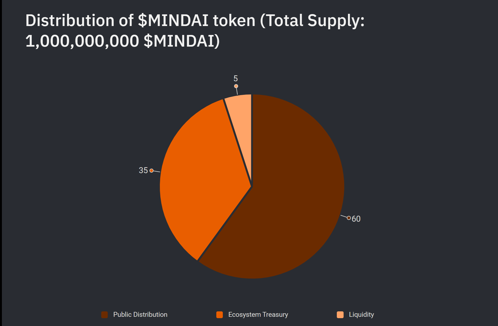

# Token Distribution

## Total Supply: 1,000,000,000 $MINDAI

All $MINDAI tokens are **fully unlocked and vested** from the outset. There is no future inflation planned—ensuring a fixed supply and long-term predictability for the ecosystem.

The token distribution is designed to support decentralization, liquidity, and sustained ecosystem growth. Here's how the total supply of **1 billion $MINDAI tokens** is allocated:

***

<figure><figcaption></figcaption></figure>

#### 🔹 Public Distribution — 60%

**600,000,000 tokens** (60% of total supply) are in **public circulation**, ensuring broad accessibility and community participation from the beginning.

***

#### 🔹 Liquidity Pool — 5%

**50,000,000 tokens** are allocated to establish and deepen liquidity pools for the $MINDAI token across supported decentralized exchanges.

This ensures that agents and users can freely access and exchange $MINDAI to interact with the broader MindAI ecosystem.

***

#### 🔹 Ecosystem Treasury — 35%

**350,000,000 tokens** are reserved for the **MindAI Ecosystem Treasury**. This allocation is dedicated to:

* Community incentives
* Ecosystem development
* Strategic initiatives that accelerate adoption and growth

These funds are managed by a **DAO-controlled multi-sig wallet**, with strict emission limits of **no more than 10% per year for the next 3 years**. Disbursement is subject to **governance approval** and aligned with transparent, community-led decision-making.
